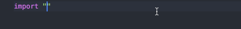

# importcost package

know your import load - inspired from [wix/import-cost](https://marketplace.visualstudio.com/items?itemName=wix.vscode-import-cost)

### Installation

```
apm install importcost
```

### Demo


___when an npm module is not installed locally___


### Usage & Working
Just install the package and it kicks in for '.js' and '.ts' files.
The size will be calculated and displayed on the same line.
__importcost__ is triggered when active panel is switched / saved.

If the module hasn't been installed / not present in `package.json`, it assumes the latest version of the module.

### Credits

- [wix/import-cost](https://github.com/wix/import-cost/tree/master/packages/import-cost) -
  Enables traversing `node_modules` to find the module cost.
- [pastelskys](https://github.com/pastelsky/bundlephobia])
[bundlephobia](https://bundlephobia.com/]) - Providing the means to find module
cost via an API. [Used as a fallback mechanism]

Do check them amount ^\_^

### Contributing

PRs welcome as long it doesn't break existing functionality and all hell breaks loose!
